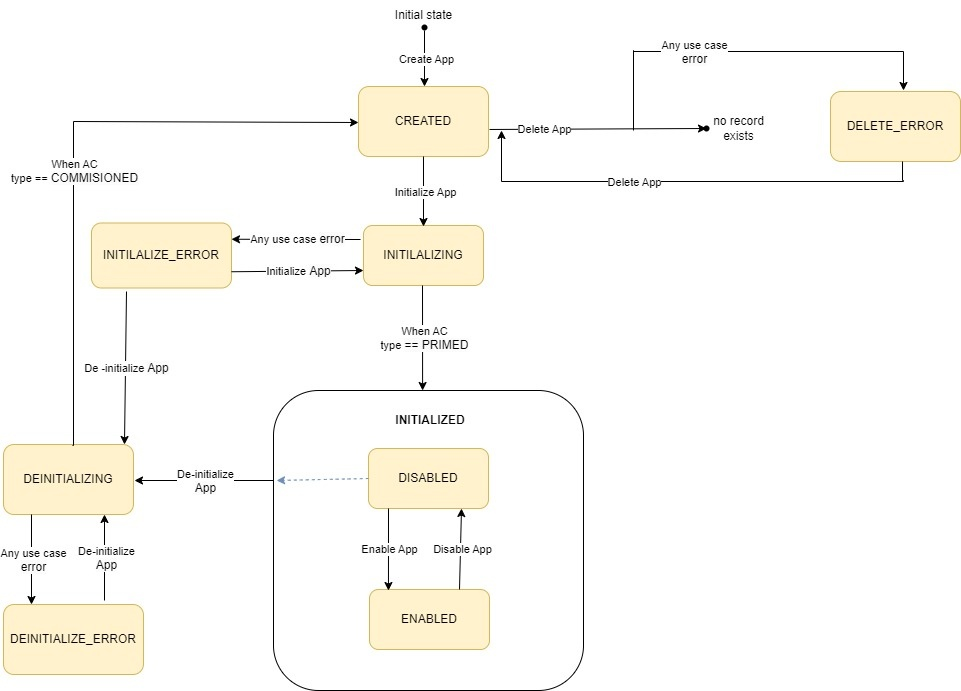
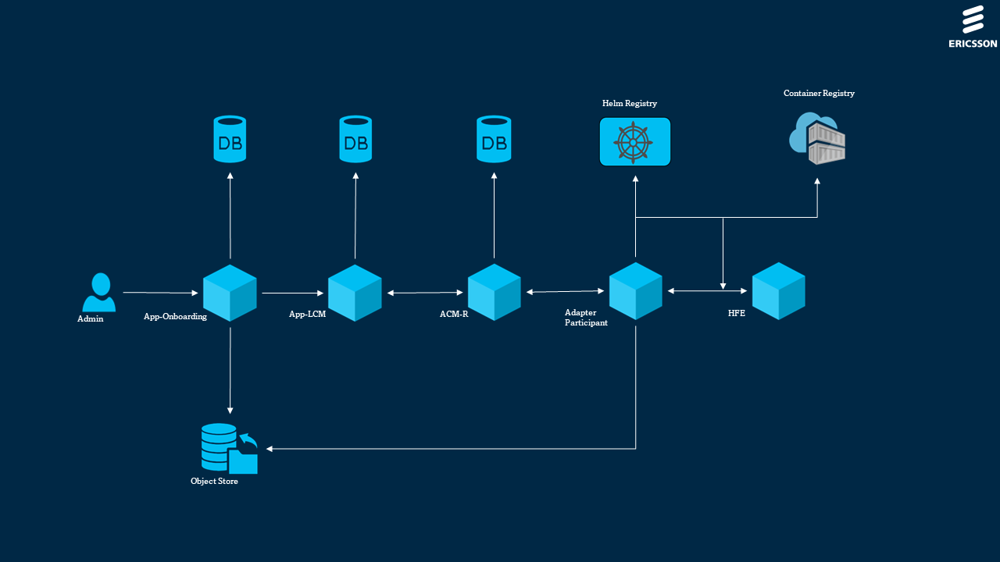

# App LCM User Guide

[TOC]

## Overview

The App Life Cycle Management (App LCM) component has the following responsibilities:
- Maintain a registry of Apps deployed and created with a reference
to the artifact identities and instance identifiers as exposed by the platform services.
- Trigger initialize/deinitialize/enable/disable/delete operations (as required) for the App artifacts.

The basic idea is that the App implements business logic to
(partly or completely) realize automated network management use cases.
Such Apps are intended to be small, both in terms of functionality
(realizing relatively small, well-defined use cases) and in terms of
software (delegating as much behavior as possible to the platform).
The job of App LCM service is to perform the Life Cycle Management (initialize, upgrade
(i.e. deploy new versions), deinitialize or delete) of the App components.

### App LCM Version 3 API - Supported Use Cases

| Use Case Id  | Use Case Title           | Compliance      |
|--------------|--------------------------|-----------------|
| UC.LCM.V3.01 | Create an App            | Fully supported |
| UC.LCM.V3.02 | Initialize an App        | Fully supported |
| UC.LCM.V3.03 | DeInitialize an App      | Fully supported |
| UC.LCM.V3.04 | Enable an App            | Fully supported |
| UC.LCM.V3.05 | Disable an App           | Fully supported |
| UC.LCM.V3.06 | Delete an App            | Fully supported |
| UC.LCM.V3.07 | Create an App Instance   | Fully supported |
| UC.LCM.V3.08 | Deploy an App Instance   | Fully supported |
| UC.LCM.V3.09 | Undeploy an App Instance | Fully supported |
| UC.LCM.V3.10 | Upgrade an App Instance  | Fully supported |
| UC.LCM.V3.11 | Delete an App Instance   | Fully supported |
| UC.LCM.V3.12 | Update an App Instance   | Fully supported |

### App LCM Version 1 API - Supported Use Cases

| Use Case Id | Use Case Title                                            | Compliance      |
|-------------|-----------------------------------------------------------|-----------------|
| LCM-UC-01   | Instantiate an App                                        | Fully supported |
| LCM-UC-02   | Undeploy an Instance of an App                            | Fully supported |
| LCM-UC-03   | To Get List of All Instances of every App                 | Fully supported |
| LCM-UC-04   | To Get one or many Specific Instance of an App            | Fully supported |
| LCM-UC-05   | To Get List of All Artifacts from an Instance             | Fully supported |
| LCM-UC-06   | To Get Specific Artifact on an Instance                   | Fully supported |
| LCM-UC-07   | Update an App                                             | Fully supported |
| LCM-UC-08   | Delete an App Instance List                               | Fully supported |
| LCM-UC-09   | Delete an App                                             | Fully supported |

### App LCM Version 3 API - App States

| Use Case            | App LCM App State                           |
|---------------------|---------------------------------------------|
| Create an App       | CREATED                                     |
| Initialize an App   | INITIALIZED, INITIALIZING, INITIALIZE_ERROR |
| Deinitialize an App | CREATED, DEINITIALIZING, DEINITIALIZE_ERROR |
| Delete an App       | DELETE_ERROR                                |

### App LCM Version 3 API - App Instance States

| Use Case                 | App LCM Instance State                  |
|--------------------------|-----------------------------------------|
| Create an App Instance   | UNDEPLOYED                              |
| Deploy an App Instance   | DEPLOYED, DEPLOYING, DEPLOY_ERROR       |
| Update an App Instance   | DEPLOYED, UPDATING, UPDATE_ERROR        |
| Upgrade an App Instance  | DEPLOYED, UPGRADING, DEPLOY_ERROR       |
| Undeploy an App Instance | UNDEPLOYED, UNDEPLOYING, UNDEPLOY_ERROR |
| Delete an App Instance   | DELETING, DELETE_ERROR                  |

### App LCM Version 3 API - App Modes

- DISABLED
- ENABLED

Mode provides an administrative flag for App, to allow operator to create an App instance for that App, if the mode is Enabled.

### App LCM Version 3 API - App State Transition


### App LCM Version 3 API - App Instance State Transition


### Terminologies

- **Life Cycle Management**
  Life Cycle Management (LCM) is an integrated concept for managing the total
  lifecycle of an App covering operations such as create/initialize/deinitialize/enable/disable/delete.

- **App Instance**
  Whenever a request to create an App Instance is received,
  a unique id ```appInstanceId``` is generated for an App instance.
  An App can have one or more ```appInstanceId``` created for it but only one of 
  those App instances can be deployed at any one time.
  To get/update/upgrade/deploy/undeploy/delete a specific App instance
  you need to provide the specific ```appInstanceId```.

- **Artifact Instance**
  One or more artifacts are packaged as part of an App package and these artifacts
  are executed/deployed as part of Create an App operation.
  For each artifact execution there is a unique Id generated
  ```artifactInstanceId``` per App Instance and associated to ```appInstanceId```
  To retrieve specific artifact execution status/information you
  need to provide the specific ```artifactInstanceId```.

- **HealthStatus**
  Current status of the App instance (which can be intermediate state).

- **TargetStatus**
  Requested App LCM operation target status of the App instance
  ( Final state of the App instance).
  **Example:** When "HealthStatus" is in "UNDEPLOYING" status and "TargetStatus"
  is "UNDEPLOYED" which means the request is in progress and
  App instance need to be "UNDEPLOYED".

- **Client Id**
  App LCM uses ``appOnboardingId`` to create a unique identifier of the App
  instance into Keycloak. The name pattern consists of three parts,
  a hardcoded prefix, ``appOnboardingId``, and the timestamp format.
  **Example:** ``rAppId-{app_onboarding_id}-{timestamp}``

- **Client Secret**
  User uses the secret created by App LCM.

- **Client Scope**
  App LCM uses client scope to modify the default ``aud``
  parameter to contain the ``kafka`` tag.

- **Token**
  App LCM uses a username and password to be authenticated.
  An administrative token is extracted in every operation
  during the installation of Keycloak, which is contained in API gateway.

- **ACM-R**
  Automation Composition Management - Runtime.
  ONAP based use case automation engine.

### App LCM Version 3 API - Architecture

The following figure shows the place of App LCM Service within the App Manager Architecture.



### Deployment View

App LCM is packaged as a Docker container.

It supports deployment on Kubernetes.

It is dependent on PostgreSQL that is installed as a database backend.

App LCM Service is stored in one container in a pod.


To deploy the Service, refer to the [Deployment section](#deployment), which:

- explains how to get started using App LCM Service in the supported
  environments.
- specifies configuration options for starting App LCM docker container.

If problems occur when using the service, refer to the
[Troubleshooting section](#troubleshooting).

### Dimensioning and Characteristics

#### Dimensioning

The service provides by default resource request values and
resource limit values as part of the Helm chart.

These values correspond to a default size for deployment of an instance.

This chapter gives guidance in how to do service dimensioning and
how to change the default values when needed.

#### Consider Dimensioning Aspects

Consider the basic dimensioning attributes listed in the Configuration
Parameters section and decide on a target initial API transaction capacity on the
utilized interfaces.

The below provided figures are approximate and for guidance only.
Figures were produced using a reference system.

The values below reflect modelled traffic, i.e. when only a single interface is
utilized.

Based on the above values, derive the resource requirements for Kubernetes.

The values below are defined in Kubernetes resource units.

| Image name       | Initial number of instances | Local storage per instance | Resource request memory | Resource request CPU | Resource limit memory | Resource limit CPU |
|------------------|-----------------------------|----------------------------|-------------------------|----------------------|-----------------------|--------------------|
| eric-oss-app-lcm | 1                           | None                       | 256Mi                   | 125m                 | 2Gi                   | 1000m              |

#### Override Default Dimensioning Configuration

If other values than the default resource request and default resource limit
values are preferred, they must be overridden at deployment time.

Here is an example of the helm install command where resource requests and
resource limits are set for a minimum configuration.

```bash
helm install eric-oss-app-lcm \
https://arm.seli.gic.ericsson.se/artifactory/proj-eric-oss-drop-helm-local/eric-oss-app-lcm/eric-oss-app-lcm-1.0.60-1.tgz  \
--namespace test-deployment-namespace \
--set resources.requests.cpu=125m \
--set resources.requests.memory=256Mi \
--set resources.limits.cpu=1000m \
--set resources.limits.memory=2Gi
```

| Image name       | Resource request memory | Resource request CPU | Resource limit memory | Resource limit CPU |
|------------------|-------------------------|----------------------|-----------------------|--------------------|
| eric-oss-app-lcm | 256Mi                   | 125m                 | 2Gi                   | 1000m              |

To use minimum configuration, override the default values for resource requests
and resource limits in the Helm chart at deployment time.

#### Use Maximum (Default) Configuration per Service Instance

The maximum recommended configuration per instance is provided as default in
the Helm chart.

Both Resource Request values and Resource Limit values are included in the
Helm charts.

#### Upgrade - In Service Software Upgrade

App LCM supports upgrade without loss of persistent service configuration data,
and notifications.

## App LCM Version 3 API - Use Cases

### UC.LCM.V3.01 Create an App

- App Onboarding prepares a JSON string containing all the App package information required for App instantiation.
- App Onboarding sends a POST request to App LCM, including the JSON string in the request body, to create an app.
- App LCM parses the JSON body of the request and stores the parsed data in App LCM database.
- Using the type of App components provided by App Onboarding, App LCM utilizes the TOSCA Service Template generation tool
  to generate a TOSCA Service Template YAML file representing the app.
- The TOSCA Service Template generation tool, implemented in Java and utilizing FreeMarker, produces the TOSCA Service Template YAML file.
- App LCM sends a POST request to ACM-R, including the generated TOSCA Service Template in the request body, to create the App composition.
- ACM-R performs a basic check to ensure that the TOSCA Service Template includes the required definitions for
  org.onap.policy.clamp.acm.AutomationComposition and org.onap.policy.clamp.acm.AutomationCompositionElement.
- Upon successful validation, ACM-R stores the TOSCA Service Template in its database for future reference.
- ACM-R returns a serialized instance of the Automation Composition type to App LCM in JSON format.
  This serialized instance includes a UUID that references the Automation Composition type and its defined nodes.
- App LCM stores the received UUID in its database, associating it with the App being created.
- App LCM returns a serialized response to App Onboarding, providing detailed information about the created app.

### UC.LCM.V3.02 Initialize an App

- The initialize request is made and is received with the App Id.
- The App Id is extracted from the request.
- It is verified whether the apps mode is DISABLED and status is CREATED / INITIALIZE_ERROR mode.
- It gets the ac definition details and returns them.
- A check is done to see if the ACM-R status is commissioned .
- If No then a 404 Bad Request error is thrown.
- If Yes A put request is sent to prime the ACM.
- If the conditions are met, the App state is updated to INITALIZING and the App details are updated and a 202 ACCEPTED is thrown.

### UC.LCM.V3.03 DeInitialize an App

- The de-initialize request is made and is received with the App Id.
- The App Id is extracted from the request.
- It is verified whether the App is initialized and in DISABLED mode.
- A DEPRIME request is sent to ACM-R (App Composition Manager - Runtime).
- If the conditions are met, the App state is updated to "DEINITIALIZING" and to "DEINITIALIZE_ERROR" for error scenarios.
- Upon receiving a successful response, the respective objects are deinitialized from the LCM DB.

### UC.LCM.V3.04 Enable an App & UC.LCM.V3.05 Disable an App

- The user sends a PUT request to App LCM to change the App mode. This request includes the
  desired mode (ENABLED or DISABLED) as a parameter or in the request body.
- The  App LCM receives the PUT request and extracts the desired mode from the request parameters or body and determines whether the App becomes accessible or inaccessible for users within the system.
- The  App LCM queries the database to check the current status of the app.
- If the App status is not in the INITIALIZED state, the  App LCM responds with a 400 Bad Request error to indicate
  that the operation is not allowed in the current App state. The response message should inform the user about the invalid state.
- If the App status is INITIALIZED, the server proceeds to check the mode.
- If the mode is already ENABLED and the user requested to enable it again, the  App LCM responds
  with a 400 Bad Request error, indicating that the mode is already enabled.
- If the mode is already DISABLED and the user requested to disable it again, the  App LCM responds
  with a 400 Bad Request error, indicating that the mode is already disabled.
- If all checks pass (App status is INITIALIZED, and the mode is valid for the requested operation),
  the  App LCM updates the App mode based on the user's request.
- After successfully updating the App mode, the  App LCM responds with a 200 OK status code to acknowledge the operation's success.
  The response may also include a confirmation message indicating the new App mode.
- If there was an error during any of the steps, the  App LCM responds with a 400 Bad Request status code,
  providing an appropriate error message that explains why the request failed.

### UC.LCM.V3.06 Delete an App

- The delete request is received with the App Id.
- The App Id is extracted from the request.
- The App instance details are fetched from the LCM DB to check if the instance exists.
- If the instance exists, the App details are retrieved.
- It is verified whether the App is in disabled mode and the App state is either CREATED or INITIALIZE_ERROR / DEINITIALIZE_ERROR.
- As part of the monitoring job, a GET API call is made to ACM-R to retrieve the composition
  and ensure that the Automation composition definition is commissioned.
- If the commissioning is successful, a DELETE ACM-R definition API request is sent.
- Upon receiving a successful response, the respective objects are deleted from the object store.
- The bucket associated with the App is deleted from the object store
- Finally, the App entry is deleted from the LCM DB.

### UC.LCM.V3.07 Create an App Instance

- User initiates a request to instantiate an App through App LCM component.
- App LCM verifies user privileges and App enablement to ensure the instantiation conditions are met.
  If the conditions are not satisfied, the instantiation operation is rejected.
- Check App permission contains KAFKA. if no, create the client id directly
- If KAFKA permission exists, then, Check scope exists for permission KAFKA in LCM DB
- Call the keycloak client to get all the scopes
- check scope exists in keycloak scope list. If no, then create scope in keycloak
- Create client id and pass default properties to the client which is stored in the ClientJson.json file.
- Add the scope details to client if it exists
- Create client in keycloak and update the status of Credential event as PENDING in LCM DB
- Create the secret and update the status of Credential event as CREATED in LCM DB
- Check whether any roles present in LCM DB. If No, create the service property yaml file
- If roles are present, then get all the roles list from Keycloak.
- Make sure that all the roles present as part of the App are available in the roles list response from keycloak.
- Get the keycloak clients from the keycloak and filter out the id based on the instance id in LCM DB.
- Get the service  accounts based on the id from keycloak
- Map associate roles based on the service account in keycloak
- Generate the instance property yaml file and create an instantiation request to ACM-R to get the instance id back.
- The instantiation request is logged by App LCM, and a unique identifier is assigned to track the process.
- Save the instance details in LCM DB.

### UC.LCM.V3.08 Deploy an App Instance

- After successful creation, App LCM deploys the App instance to ACM-R, ensuring it is properly set up
  and ready to execute within the designated runtime environment.
- A monitoring job periodically polls ACM-R to monitor the status of the instantiated App instance,
  gathering real-time information about its state and any updates or changes.
- The monitoring job follows a predefined schedule, such as polling every few seconds,
  to maintain continuous awareness of the App instance's status.

### UC.LCM.V3.09 Undeploy an App Instance

- Admin user calls the V3 API to undeploy app-instance at LCM
- App LCM will retrieve the App details from the DB using app-instance-id in the request path
- App LCM will check whether App instance status is either DEPLOYED or DEPLOY_ERROR or UNDEPLOY_ERROR
- If status does not meet above the user will receive 404 Bad Request
- By using composition-id and ac-instance-id in the App--Instance/App details, App-Lcm will call ACM-R to undeploy the app-instance
- Upon successful response from ACM, App-Lcm will update the App-Instance status in the DB as Status: UNDEPLOYING
- At the end, a success response of 202 or 500 Internal Server Error will be sent to the user depend on ACM-R response

### UC.LCM.V3.10 Upgrade an App Instance

- User sends a upgrade request to App LCM
- App Detail request from App LCM is sent to the Lcm Db
- Keycloak Resources are created
- Credential Event is Created
- App LCM App instance and status is validated
- Put request is sent to ACM-R with new information
- 202 accepted is sent back
- Targeted App Id with new information is sent back to the user from the Lcm Db

### UC.LCM.V3.11 Delete an App Instance

- Admin user calls the V3 API for delete app-instances to remove all the App instances, or
  it can delete specific App instance by passing the appInstanceId along with App Id at LCM.
- App LCM retrieves the App instance details from the database based on the provided appInstanceId and
  in case of deletion of all App instances loop will work to get the individual App instances .
- App LCM validates the instance status before proceeding with the deletion.
  It checks if the instance status is already UNDEPLOYED or if it has FAILED.
- If the instance is still active, App LCM returns a 400 error, preventing the deletion of an active App instance.
- Upon successful validation, App LCM fetches the App details associated with the App instance from the database, including the compositionId.
- App LCM interacts with ACM-R by making a DELETE REST call for each App instance, passing the corresponding compositionId.
- ACM-R receives the DELETE request and proceeds to delete the App instance from the runtime environment.
- Once ACM-R confirms the successful deletion, App LCM updates the App instance status in the database.
- The healthStatus field is set to DELETING, indicating that the App instance is currently being deleted.
- The targetStatus field is updated to DELETED, reflecting the successful completion of the deletion operation.
- App LCM sends a success response with the HTTP status code 204 back to the admin user,
  indicating the successful deletion of the App instance.
- A monitoring job specific to the application composite instance is triggered.
- The monitoring job continuously monitors the status of the composite instance, overseeing the progress of the deletion process.
- Once the composite instance is no longer available, indicating the successful deletion,
  the monitoring job invokes the delete method on the LCM database.
- The delete method removes the App instance data from the database, ensuring data integrity and efficient resource management.

### UC.LCM.V3.12 Update an App Instance

Scenario 1. UPDATE DEPLOYED Instance
- Get App details from LCM DB and from ACM-R for existing properties' data.
- Check if the status of the App instance is DEPLOYED.
- Build the ACM-R request body with the componentId and its properties with updated properties.
- Call The Update API (ACM-R) with the updated properties.
- Get 200 OK
- Update status to UPDATING to LCM DB
- Return 202 Accepted
- Monitoring Job will monitor the status.
- Once successful, update status in LCM DB to DEPLOYED.

Scenario 2. UPDATE UNDEPLOYED Instance
- Get App details from LCM DB
- Check if the status of the App instance is UNDEPLOYED
- Call The Update API (ACM-R) with the updated properties.
- Get 200 OK
- Return 200 OK

## App LCM Version 1 API - Use Cases

### LCM-UC-01: Instantiate an App

**Description:** Instantiate an App by onboarding through the App manager
onboarding service. As part of the App instantiation, an ```appInstanceId```
is created. The instantiation process also deploys the artifacts that are
included as part of the App package. If the artifact deployment fails,
the App instantiation is undeployed and the App instance status is updated
as failed. Multiple instances of Apps can be instantiated for an App.

**Precondition:** Requested App must be onboarded through App onboarding in the
App manager.

**Successful End Condition:** An App is deployed and an instance is created for
the requested App.

### LCM-UC-01.2: Instantiate an App with Keycloak resources

**Description:** In order to instantiate an App, the App should have been
onboarded through App manager App onboarding service. As part of App
instantiation an "appInstanceId" is created and deploys the artifacts which
are included as part of App package. On failure of any artifact deployment,
the App instantiation is undeployed and updates the App instance status
as failed. Multiple instance of Apps can be instantiated for an App.

**Precondition:** Requested App should have been onboarded through App
onboarding in App manager App descriptor must contain resource: "kafka"
and a custom scope, this triggers Client creation flow.

**Successful End Condition:** An App is deployed and an instance is created
for the requested App, client and secret mus be passed through additional
properties.

### LCM-UC-02: Undeploy an Instance of an App

**Description:** In order to undeploy an App instance,
the App instance should be in INSTANTIATED or FAILED
(the instantiation could fail partially) health status.
It required at least one valid ```appInstanceId``` in order to undeploy the App instance.
Termination supports only one appInstance at a given time.
The App instance health status is set to PENDING and target status to UNDEPLOYED
during termination.
Successful termination sets health status to be UNDEPLOYED for the App instance.
Unsuccessful termination sets health status to be FAILED for the App instance.
Target status stays the same - UNDEPLOYED.


**Precondition:** ```appInstanceId``` must be in INSTANTIATED/FAILED health status.

**Successful End Condition:** Instance with ```appInstanceId``` passed as a
param is undeployed.

### LCM-UC-02.1: Terminate an Instance of an App with resources on Keycloak

**Description:** In order to terminate an App instance,
the App instance should be in INSTANTIATED or FAILED
(the instantiation could fail partially) health status.
It required at least one valid ```appInstanceId``` in order to terminate the App instance.
Termination supports only one appInstance at a given time.
The App instance health status is set to PENDING and target status to UNDEPLOYED
during termination.

If the App contains resources on Keycloak,  marks the credentials that
need to be deleted, App-LCM Job deletion will be monitoring those credentials.
App-LCM removes both resources from keycloak and CredentialEvent repo.

Successful termination sets health status to be UNDEPLOYED for the App instance.
Unsuccessful termination sets health status to be FAILED for the App instance.
Target status stays the same - UNDEPLOYED.

**Precondition:** ```appInstanceId``` must be in INSTANTIATED/FAILED status.
AppOnboardingId must be on CredentialEventTable and its status must be UNDEPLOYED

**Successful End Condition:** Instance with ```appInstanceId``` passed as a
param is terminated. Resources on Keycloak and CredentialEvent should be empty for that App.

### LCM-UC-03: To Get List of All Instances of every App

**Description:** You can retrieve the App instance information for all
LCM managed Apps through App LCM service API.

**Precondition:** 1...N instance for Apps has been instantiated.

**Successful End Condition:** Retrieves all instances of Apps.

### LCM-UC-04: To Get one or many Specific Instance of an App

**Description:** An App can have one or more ```appInstanceId``` instantiated
to it. You must provide the specific ```appOnboardingId``` in order to
retrieve, monitor, or terminate a specific App instance. App LCM can
retrieve information such as the target status of the App, the creation time
and the associated onboarded appId of the provided appInstance.

**Precondition:** Valid ```appOnboardingId```. For example, you must execute
App LCM in order to retrieve  the ```appInstanceId``` info.

**Successful End Condition:** User retrieves required ```appInstanceId```
information.

### LCM-UC-04 and LCM-UC-03: Both share the same end point

### LCM-UC-05: To Get List of All Artifacts from an Instance

**Description:** When you execute each artifact of the App package,
a unique ```artifactInstanceId``` is assigned in each App instance.
App LCM retrieves the information about the list of artifacts which are
associated with ```appInstanceId```.

**Precondition:** The artifact must be executed as part of App instantiation.

**Successful End Condition:** User retrieves all artifacts related with the App
instance Id ```appInstanceId```.

### LCM-UC-06: To Get Specific Artifact on an Instance

**Description:** You must provide a specific ```artifactInstanceId``` in order
to retrieve the execution status details and information on a specific
artifact.This information includes the current status of the artifactInstance
, its creation time and the associated ```appInstanceId```, appId, and
artifactId of the artifact.

**Precondition:** The request contains a valid ```appInstanceId``` and
```artifactInstanceId```.

**Successful End Condition:** User has access for a specific artifact by the
```artifactInstanceId``` and associated with an instance by the
```appInstanceId``` informed.

### LCM-UC-07: Update an App

**Description:**  You must provide existing ```appInstanceId``` and
```appOnBoardingAppId```. ```appInstanceId``` for App LCM App Instance Id
for an App. ```appOnBoardingAppId``` is the App onboarding App Id
that the user wishes to upgrade to.

**Precondition:** Requested App to be upgraded to must be onboarded through App
onboarding in the App manager. App-Lcm must have the existing App
instantiated successfully already.

**Successful End Condition:** An App is updated to newer version.

### LCM-UC-08: Delete an App Instance List

**Description:**  You must provide existing ```appInstanceId``` and
```appOnBoardingAppId```. ```appOnBoardingAppId``` for the App onboarding App
Id that the user has onboarded.```appInstanceId``` is App LCM App Instance
Id for the App that the user wishes to delete to.

**Precondition:** Requested App to be deleted must be onboarded through App
onboarding in the App manager. App-Lcm must have the existing App instances
successfully undeployed (or in failed/deleted health status).

**Successful End Condition:** An App instances are deleted physically from the
App LCM and Helm Executor.

### LCM-UC-09: Delete an App

**Description:**  You must provide existing ```appOnBoardingAppId```.
```appOnBoardingAppId``` is the App onboarding App Id that the user wishes to
delete to.

**Precondition:** Requested App to be deleted must be onboarded and in disabled
mode through App onboarding in the App manager. App-Lcm must have the
existing App instances for the App successfully undeployed
(or in failed/deleted health status).

**Successful End Condition:** An App instances are deleted physically from the
App LCM, Helm Executor and Onboarding.

## Deployment

This section describes the operational procedures for how to deploy and upgrade
App LCM Service in a Kubernetes environment with Helm.
It also covers hardening guidelines to consider when deploying this service.

### Prerequisites

- A running Kubernetes environment
- Some knowledge of the Kubernetes environment,including the networking details
- Access rights to deploy and manage workloads
- Availability of the kubectl CLI tool with correct authentication details.
  Contact the Kubernetes System Admin if needed
- Availability of the helm package
- Availability of Helm charts and Docker images for the service and all
  dependent services
- Document Database PG Service

### Deployment in a Kubernetes Environment Using Helm

This section describes how to deploy the service in Kubernetes using Helm and
the Kubectl CLI client.

Helm is a package manager for Kubernetes that streamlines the installation and
management of Kubernetes applications.

### Preparation

Prepare Helm chart and Docker images.

Helm chart in the following link can be used for installation:

```text
https://arm.seli.gic.ericsson.se/artifactory/proj-eric-oss-ci-internal-helm-local/eric-oss-app-lcm/
```

### Helm Chart Installation of Document Database PG Service

Document Database PG Service dependency is already added to the
```Chart.yaml``` file. To deploy it run the following command:

```text
helm dependency update charts/eric-oss-app-lcm/ --namespace <NAMESPACE>
```

### Helm Chart Installation of App LCM Service

NOTE: Ensure Document Database PG Service is deployed and healthy before you
continue with this step (see previous chapter).

Users can override the default values provided in the values.yaml template
of the Helm chart.

#### Deploy the App LCM Service

##### App LCM Service Deployment

```text
helm install <RELEASE_NAME> <CHART_REFERENCE> --namespace <NAMESPACE>
```

##### Verify the Availability of the App LCM Service

In order to check a successful deployment of the App LCM Service, the following
steps can be performed.

- Check if the chart is installed with the provided release name and in the
  related namespace using ```helm ls``` command

```text
helm ls --namespace <NAMESPACE>
```

Output:

```bash
NAME                        NAMESPACE                   REVISION    UPDATED     STATUS      CHART                               APP VERSION
eric-oss-app-lcm      demo-deployment-namespace   1           2022-01-07 11:32:09.8444876 +0100 CET    deployed    eric-oss-app-lcm-1.0.60-1      0.1.0
```

Chart status should be reported as DEPLOYED.

- Verify the status of the Helm chart deployed, by getting the status for your
  chart installed

```bash
helm status eric-oss-app-lcm -n <NAMESPACE>
```

Example output:

```bash
LAST DEPLOYED: Fri Jan 07 11:32:09 2022
NAMESPACE: demo-deployment-namespace
STATUS: DEPLOYED
```

Chart status should be reported as DEPLOYED.

```bash
kubectl get deployment -n <NAMESPACE>
```

Example output:

```bash
NAME                                     READY   UP-TO-DATE   AVAILABLE   AGE
eric-oss-app-lcm                    1/1     1            1          5h4m
```

## Hardening

The service is by default pre-hardened. No additional hardening is required.
The following pre-hardening actions have been made:

1. The service is built on a minimalistic container image with a small
   footprint. Only the required libraries are included.
2. The service utilizes a container optimized operating system (Common Base OS)
   and the latest security patches are applied.
3. The container goes through vulnerability scanning.
4. The service is configured to the strict minimum of services and
   ports to minimize the attack surface.

## Upgrade Procedure

The App LCM Service supports upgrade without loss of persistent service
configuration data.

In Kubernetes the Helm chart upgrade can be done to migrate the App LCM Service
from the existing to a higher version.

- Check if App LCM Service is installed in the system with a specific chart
  version.

```bash
helm ls -n <NAMESPACE>
```

This should show that App LCM Service is installed having a release name and a
specific chart revision and the chart status should be reported as DEPLOYED.

- Check service type for the current App LCM Service deployment

```bash
kubectl -n <NAMESPACE> describe service <SERVICE_NAME>
```

Should print out the service details. Check the Type entry.

```<NAMESPACE>```: String value, the namespace where App LCM Service is
installed.
```<SERVICE_NAME>```: The service name used during installation, typically
eric-oss-app-lcm.

- Migrate to a higher version using Helm upgrade procedure

```text
helm upgrade <RELEASE_NAME> <CHART_REFERENCE>
```

- Should give the output Release <RELEASE_NAME> has been upgraded.
- <RELEASE_NAME>: String value, a name to identify and manage your Helm chart.
- <CHART_REFERENCE>: A path to a packaged chart, a path to an unpacked chart
  directory or a URL to upgrade to.

```text
helm upgrade eric-oss-app-lcm https://arm.seli.gic.ericsson.se/artifactory/proj-eric-oss-ci-internal-helm-local/eric-oss-app-lcm/eric-oss-app-lcm-1.0.61-1.tgz
```

## Operation and Maintenance

### Backup and Restore

App LCM does not support backup and restore itself.

For backup and restore data App LCM saved in Document Database PG Service use
next instructions:

- Backup and Restore for database:
  [Backup and Restore](https://adp.ericsson.se/marketplace/document-database-pg/documentation/6.3.0/dpi/service-user-guide#backup-and-restore)

## Troubleshooting

### Prerequisites for Troubleshooting

- ```kubectl``` CLI tool properly configured
- ```helm``` CLI tool properly configured**
